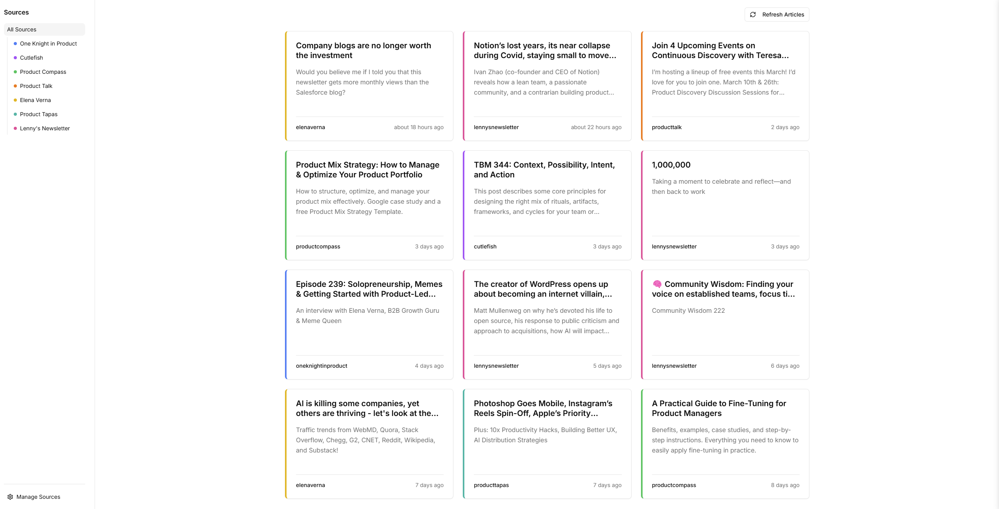

# PM & AI Newsletter Aggregator

A modern web application that aggregates articles from various Product Management and AI newsletters, providing a centralized hub for staying up-to-date with the latest insights in the field.



## Features

- 📚 Automatic article aggregation from top PM newsletters
- 🎨 Clean, modern interface with source-specific color coding
- 🔍 Filter articles by source with an intuitive sidebar
- 🔄 Real-time updates with refresh functionality
- 📱 Responsive design for all devices
- ⚡ Fast and efficient with server-side rendering
- 🎯 Focus on readability and user experience

## Tech Stack

- **Frontend**: Next.js 14, Tailwind CSS, Shadcn UI
- **Backend**: Supabase (PostgreSQL), Drizzle ORM
- **Deployment**: Vercel

## Getting Started

### Prerequisites

- Node.js 18+ and npm
- A Supabase account and project
- Git

### Environment Setup

1. Clone the repository:
```bash
git clone <repository-url>
cd pm-ai-newsletter
```

2. Install dependencies:
```bash
npm install
```

3. Create a `.env.local` file in the root directory with the following variables:
```env
DATABASE_URL=your_supabase_connection_string
```

### Database Setup

1. Create a new Supabase project at [supabase.com](https://supabase.com)

2. Get your connection details:
   - Go to Project Settings > Database
   - Copy the connection string and replace `[YOUR-PASSWORD]` with your database password
   - Add this as your `DATABASE_URL` in `.env.local`

3. Run database migrations:
```bash
npm run db:push
```

### Running the App

1. Start the development server:
```bash
npm run dev
```

2. Open [http://localhost:3000](http://localhost:3000) in your browser

## Usage

### Managing Sources

1. Click "Manage Sources" in the sidebar
2. Add new sources with:
   - Name: Display name for the source
   - URL: The source's URL
   - Color: Choose from available colors for visual distinction

### Refreshing Articles

- Click the refresh button in the top right to fetch new articles
- Articles are automatically sorted by publication date
- Filter articles by clicking on different sources in the sidebar

## Database Schema

The app uses the following tables:

- `sources`: Newsletter sources with name, slug, and color
- `articles`: Aggregated articles with metadata and source references

## Contributing

1. Fork the repository
2. Create your feature branch (`git checkout -b feature/amazing-feature`)
3. Commit your changes (`git commit -m 'Add some amazing feature'`)
4. Push to the branch (`git push origin feature/amazing-feature`)
5. Open a Pull Request

## License

This project is licensed under the MIT License - see the LICENSE file for details.

## Acknowledgments

- Built with [Next.js](https://nextjs.org/)
- UI components from [shadcn/ui](https://ui.shadcn.com/)
- Database by [Supabase](https://supabase.com/)
- ORM by [Drizzle](https://orm.drizzle.team/)
